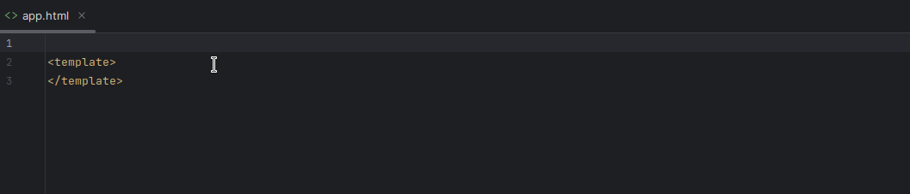

# AureliaStorm Community

<!-- Plugin description -->

This plugin brings improved support for [Aurelia Framework](https://aurelia.io) to
the [IntelliJ platform](https://www.jetbrains.com/products.html?fromMenu#lang=js&type=ide)

Plugin Supports Aurelia 1.x and 2.x

Either aurelia (v2), or aurelia-cli (v1) must be present in the project npm dependencies

### Custom elements & attributes

* Declaration resolving using `@customElement` and `@customAttribute` annotation or class names
* Custom element property recognition (`@bindable` annotation)
* Require and import tag reference detection for typescript files
* Component and property navigation (ctrl+click)
* Component lifecycle hooks (like `attached`, `detached`)
* Detecting bindable HTML attributes and events (such as `class.bind` or `click.delegate`)
* Custom element/attribute and property suggestions (ctrl+space)
* GoTo HTML/ts file action when in same folder (Default Alt+Ctrl+Shift+O)

### Insight for bindings and interpolation

* Can be enabled/disabled in the **plugin settings** (ony works with public members and can sometimes resolve references wrong)
* Code insight for `${}` and binding attribute values
* Controller properties completion and navigation
* `$this`, `$parent`, `$index`, `$event` support

### Prerequisites

Either `aurelia`, `aurelia-cli` or `aurelia-framework` must be present in `package.json`

<!-- Plugin description end -->

## Contributing

You can run the plugin using the [Run Plugin](/.run/Run%20Plugin.run.xml) configuration. This will launch an instance of intellij with the
plugin loaded (for more information check out the IntelliJ Template).

> this project is based on the [IntelliJ Platform Plugin Template](https://github.com/JetBrains/intellij-platform-plugin-template)